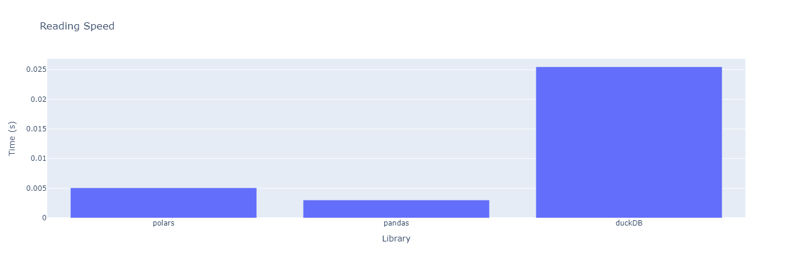
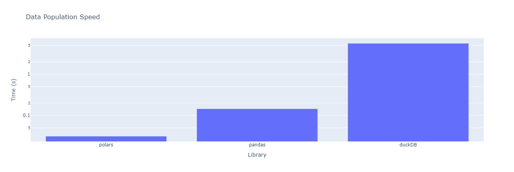
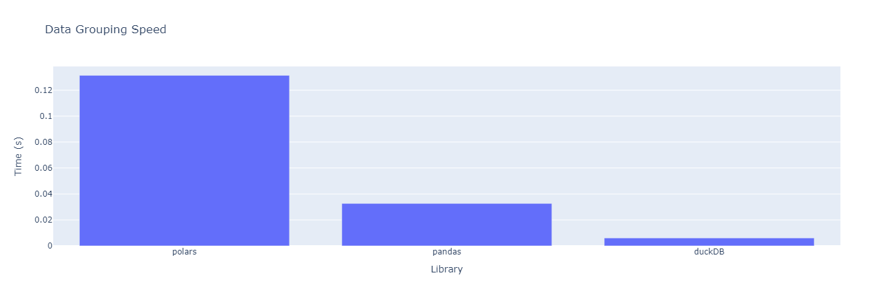
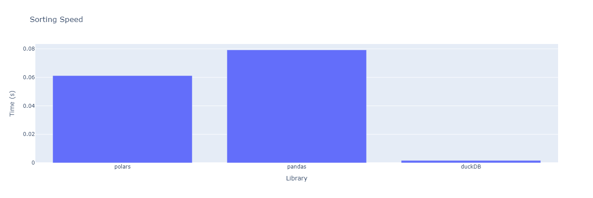
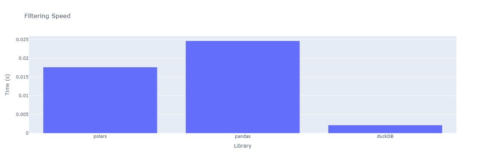
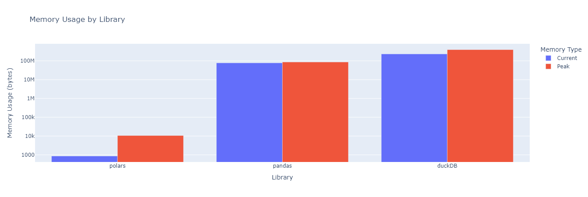
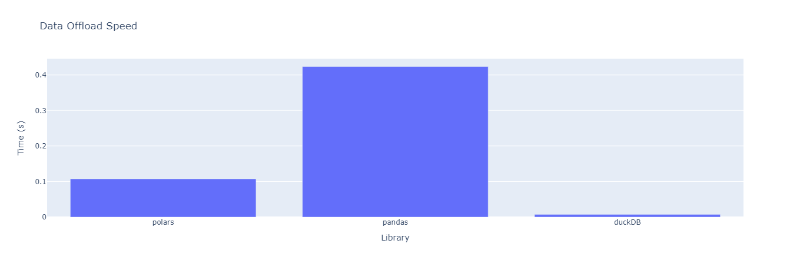

# Benchmark of Python data manipulation libraries

## 📌 Project Overview
Use python libraries for data manipulation in order to test the speed of each one when performing tasks.
For the tests used, some day to day operations like data ingestion, grouping, filtering, multiple column operation and data offload are being employed.
The libraires selected for testing are:
- Polars
- Pandas
- DuckDb

## Expected results
It is expected to obtain graphs for each test showing the speed performance and a final recopilation. This in order to provide a useful index on which libreray fits best some functionalities like analytic procedures or register augmentation.

## Hardware specs
- Alienware M16
    - RTX 4060
    - Intel Core i7 13700HX
    - 16 GB RAM 4800 MHz

## Future Work
- Add Pyspark to the benchmark
- Add Vaex
- Add Ibis
- Add Dask

## Results:
### Reading Speed

### Increment dataset vertical length

### Data grouping speed

### Data sorting speed

### Data filtering speed

### Memory usage while incrementing dataset size

### Data offloading into parquet file speed

## Conclusions

Given the logic implemented, the code provides a cleared insight of how polars and pandas perform and the diference between both libraries.
For Duckdb, as the logic convert it to a DataFrame, the usage of pandas is adding up processing time which affects it's performance in this benchmark version. Another thing to take into account it that the use of conditionals to make a single funtion per test instead of a funtion per test per library adds time to the output.

For now, the beter comparisson that can be made in most tests is between pandas and polars as duckdb is getting dragging processes on the tests. Although logic improvements are needed, base cases are being placed into the benchmark.
